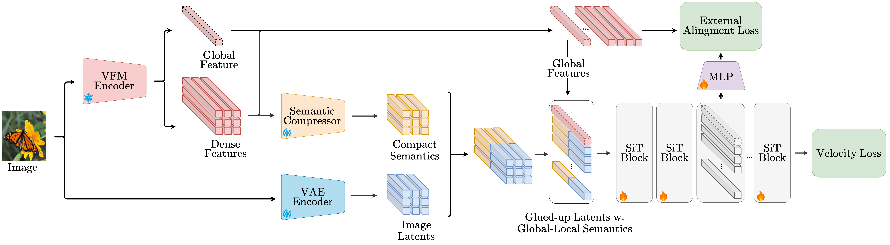

<!--             
 -->

<h1 align="center">
   REGLUE Your Latents with
    Global and Local Semantics for Entangled Diffusion
</h1>

  <a href="https://scholar.google.com/citations?user=0PI25YQAAAAJ&hl=en" target="_blank">Giorgos&nbsp;Petsangourakis</a>1,2 &ensp; <b>&middot;</b> &ensp;
  <a href="https://scholar.google.com/citations?user=Cw7CeiAAAAAJ&hl=en" target="_blank">Christos &nbspSgouropoulos</a>1 &ensp; <b>&middot;</b> &ensp;
  <a href="https://scholar.google.com/citations?user=qiDVfC4AAAAJ&hl=en" target="_blank">Bill &nbspPsomas</a>3 &ensp; <b>&middot;</b> &ensp;
  <a href="https://scholar.google.com/citations?user=BeIoqhwAAAAJ&hl=en" target="_blank">Theodoros&nbsp;Giannakopoulos</a>1 &ensp; <b>&middot;</b> &ensp;
  <a href="https://scholar.google.com/citations?user=X73G9lYAAAAJ&hl=en" target="_blank">Giorgos&nbsp;Sfikas</a>2 &ensp; <b>&middot;</b> &ensp;
  <a href="https://scholar.google.com/citations?user=B_dKcz4AAAAJ&hl=en" target="_blank">Ioannis&nbsp;Kakogeorgiou</a>1  
   
  1 IIT, National Centre for Scientific Research 'Demokritos' &emsp; 2 University of West Attica &emsp; 3 VRG, FEE, Czech Technical University in Prague &emsp;  

<!-- 

 -->

 

## The code will be uploaded soon